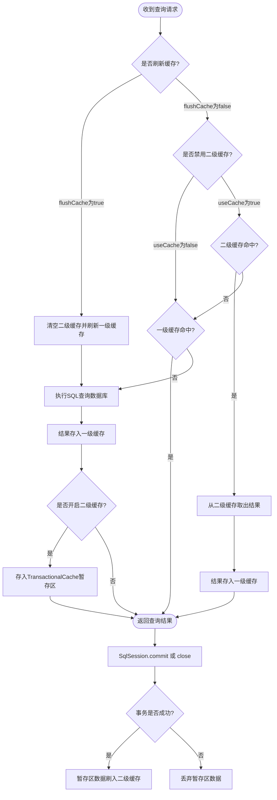

# MyBatis 学习项目

这是一个原生MyBatis学习项目，涵盖了MyBatis的核心功能和高级特性。项目通过用户-部门-订单的业务场景，演示了MyBatis在实际开发中的应用。

## 项目结构

```
src/main/java/com/example/demo/
├── entity/          # 实体类
│   ├── User.java    # 用户实体
│   ├── Department.java  # 部门实体
│   └── Order.java   # 订单实体
├── mapper/          # Mapper接口
│   ├── UserMapper.java
│   ├── DepartmentMapper.java
│   └── OrderMapper.java
├── service/         # 服务层
│   ├── UserService.java
│   ├── DepartmentService.java
│   └── OrderService.java
├── utils/           # 工具类
│   ├── SqlSessionFactoryUtil.java
│   ├── Page.java
│   └── PageParam.java
├── CacheTest.java   # 缓存测试
├── LazyLoadingTest.java  # 延迟加载测试
└── RelationTest.java     # 关系映射测试

src/main/resources/
├── mybatis-config.xml    # MyBatis配置文件
├── logback.xml          # 日志配置
├── ehcache.xml          # 缓存配置
└── com/example/demo/mapper/  # Mapper XML文件
    ├── UserMapper.xml
    ├── DepartmentMapper.xml
    └── OrderMapper.xml
```

## 1. MyBatis 配置

### 1.1 类型别名 (Type Aliases)

在 [`mybatis-config.xml`](src/main/resources/mybatis-config.xml#L20-L23) 中配置了类型别名：

```xml
<!-- 类型别名 -->
<typeAliases>
    <package name="com.example.demo.entity"/>
</typeAliases>
```

这样配置后，在Mapper XML中可以直接使用类名而不需要写完整的包名，例如：
- `type="User"` 代替 `type="com.example.demo.entity.User"`
- `type="Department"` 代替 `type="com.example.demo.entity.Department"`

### 1.2 环境配置 (Environments)

在 [`mybatis-config.xml`](src/main/resources/mybatis-config.xml#L25-L37) 中配置了数据库环境：

```xml
<!-- 环境配置 -->
<environments default="development">
    <environment id="development">
        <transactionManager type="JDBC"/>
        <dataSource type="POOLED">
            <property name="driver" value="com.mysql.cj.jdbc.Driver"/>
            <property name="url" value="jdbc:mysql://localhost:3306/mydb?..."/>
            <property name="username" value="username"/>
            <property name="password" value="123456"/>
        </dataSource>
    </environment>
</environments>
```

- `transactionManager`: 指定事务管理器类型，JDBC表示使用JDBC的事务管理
- `dataSource`: 指定数据源类型，POOLED表示使用连接池

### 1.3 映射器 (Mappers)

在 [`mybatis-config.xml`](src/main/resources/mybatis-config.xml#L39-L42) 中配置了映射器：

```xml
<!-- 映射器 -->
<mappers>
    <package name="com.example.demo.mapper" />
</mappers>
```

使用包扫描方式注册Mapper，MyBatis会自动扫描指定包下的所有Mapper接口。

## 2. MyBatis生命周期和作用域

### 2.1 SqlSessionFactory

[`SqlSessionFactoryUtil`](src/main/java/com/example/demo/utils/SqlSessionFactoryUtil.java) 类展示了SqlSessionFactory的创建和使用：

```java
public class SqlSessionFactoryUtil {
    private static SqlSessionFactory sqlSessionFactory;

    static {
        try {
            String resource = "mybatis-config.xml";
            InputStream inputStream = Resources.getResourceAsStream(resource);
            sqlSessionFactory = new SqlSessionFactoryBuilder().build(inputStream);
        } catch (IOException e) {
            e.printStackTrace();
        }
    }

    public static SqlSessionFactory getSqlSessionFactory() {
        return sqlSessionFactory;
    }
}
```

- **生命周期**: 应用程序整个生命周期
- **作用域**: 全局单例，一个数据库对应一个SqlSessionFactory
- **创建**: 通过SqlSessionFactoryBuilder创建

### 2.2 SqlSession

在 [`UserService`](src/main/java/com/example/demo/service/UserService.java#L19) 中展示了SqlSession的使用：

```java
try (SqlSession sqlSession = SqlSessionFactoryUtil.getSqlSessionFactory().openSession()) {
    UserMapper mapper = sqlSession.getMapper(UserMapper.class);
    // 执行数据库操作
    sqlSession.commit(); // 提交事务
}
```

- **生命周期**: 请求或方法级别
- **作用域**: 方法或请求级别，非线程安全
- **使用**: 每次数据库操作都应该创建新的SqlSession

### 2.3 Mapper

Mapper接口的生命周期与SqlSession绑定，通过SqlSession获取：

```java
UserMapper mapper = sqlSession.getMapper(UserMapper.class);
```

- **生命周期**: 与SqlSession相同
- **作用域**: 方法级别
- **特点**: 接口代理实现，线程不安全

## 3. resultMap结果映射

### 3.1 基本结果映射

在 [`UserMapper.xml`](src/main/resources/com/example/demo/mapper/UserMapper.xml#L7-L13) 中定义了基本结果映射：

```xml
<resultMap id="userResultMap" type="User">
    <id property="id" column="id" />
    <result property="name" column="name" />
    <result property="email" column="email" />
    <result property="age" column="age" />
    <result property="departmentId" column="department_id" />
</resultMap>
```

- `id`: 标识主键字段
- `result`: 标识普通字段
- `property`: Java实体属性名
- `column`: 数据库列名

#### 3.1.1 resultMap的使用方式

resultMap在MyBatis中有多种使用方式：

1. **在select语句中引用**：在 [`UserMapper.xml`](src/main/resources/com/example/demo/mapper/UserMapper.xml#L71-L72) 中：

```xml
<select id="selectById" resultMap="userResultMap">
    SELECT id, name, email, age, department_id
    FROM user WHERE id = #{id}
</select>
```

2. **继承和扩展**：在 [`UserMapper.xml`](src/main/resources/com/example/demo/mapper/UserMapper.xml#L16-L23) 中：

```xml
<resultMap id="userWithDepartmentResultMap" type="User" extends="userResultMap">
    <association
        property="department"
        resultMap="com.example.demo.mapper.DepartmentMapper.departmentResultMap"
        columnPrefix="dept_"
    />
</resultMap>
```

3. **跨Mapper引用**：可以在一个Mapper中引用另一个Mapper的resultMap：

```xml
<association
    property="department"
    resultMap="com.example.demo.mapper.DepartmentMapper.departmentResultMap"
    columnPrefix="dept_"
/>
```

#### 3.1.2 resultMap的优势

1. **解决列名与属性名不匹配问题**：当数据库列名与Java属性名不一致时，可以通过resultMap进行映射
2. **复杂结果映射**：处理一对一、一对多等复杂关系
3. **重用性**：定义一次后可在多个查询中重用
4. **类型转换**：可以在映射过程中进行类型转换

#### 3.1.3 resultMap与resultType的区别

| 特性 | resultMap | resultType |
|------|-----------|------------|
| 映射方式 | 手动映射 | 自动映射 |
| 灵活性 | 高，可处理复杂映射 | 低，仅适用于简单映射 |
| 性能 | 略低（需要额外映射） | 略高（自动映射） |
| 适用场景 | 复杂查询、列名不匹配 | 简单查询、列名匹配 |

#### 3.1.4 自动映射与resultMap结合使用

MyBatis支持自动映射与resultMap结合使用，在 [`mybatis-config.xml`](src/main/resources/mybatis-config.xml#L9) 中配置：

```xml
<!-- 开启驼峰命名转换 -->
<setting name="mapUnderscoreToCamelCase" value="true"/>
```

开启此设置后，MyBatis会自动将数据库的下划线命名转换为Java的驼峰命名，如`department_id`自动映射到`departmentId`。对于未在resultMap中明确映射的列，MyBatis会尝试自动映射。

### 3.2 继承结果映射

在 [`UserMapper.xml`](src/main/resources/com/example/demo/mapper/UserMapper.xml#L16-L23) 中展示了结果映射的继承：

```xml
<resultMap id="userWithDepartmentResultMap" type="User" extends="userResultMap">
    <association
        property="department"
        resultMap="com.example.demo.mapper.DepartmentMapper.departmentResultMap"
        columnPrefix="dept_"
    />
</resultMap>
```

- `extends`: 继承已有的结果映射
- `columnPrefix`: 为关联表的列名添加前缀，避免列名冲突

## 4. 日志工厂

### 4.1 MyBatis日志适配机制

MyBatis通过SLF4J (Simple Logging Facade for Java) 接口实现日志的统一管理，可以适配各种日志实现框架。MyBatis的日志适配机制如下：

#### 4.1.1 日志接口适配

MyBatis通过`org.apache.ibatis.logging.LogFactory`类来管理日志实现，它会自动检测并加载可用的日志实现：

```java
// MyBatis日志工厂初始化 (不同版本可能不一样)
static {
    tryImplementation(LogFactory::useSlf4jLogging);
    tryImplementation(LogFactory::useCommonsLogging);
    tryImplementation(LogFactory::useLog4J2Logging);
    tryImplementation(LogFactory::useLog4JLogging);
    tryImplementation(LogFactory::useJdkLogging);
    tryImplementation(LogFactory::useNoLogging);
  }
```

支持的日志实现优先级：
1. **SLF4J** - 推荐使用，现代日志门面
2. **Commons** - 早期日志门面
3. **Log4j2** - 功能强大，配置灵活
4. **Log4j** - 传统日志框架
5. **JDK** - JDK内置日志
6. **NoLogging** - 无日志输出

#### 4.1.2 手动指定日志实现

可以通过在`mybatis-config.xml`中指定日志实现：

```xml
<settings>
    <!-- 指定日志实现 -->
    <setting name="logImpl" value="SLF4J"/>
    <!-- 或者 -->
    <setting name="logImpl" value="LOG4J2"/>
</settings>
```

### 4.2 项目日志配置

项目使用Logback作为日志实现，在 [`logback.xml`](src/main/resources/logback.xml) 中配置：

```xml
<?xml version="1.0" encoding="UTF-8"?>
<configuration>
    <!-- 控制台输出 -->
    <appender name="STDOUT" class="ch.qos.logback.core.ConsoleAppender">
        <encoder>
            <pattern>%d{yyyy-MM-dd HH:mm:ss} [%thread] %-5level %logger{36} - %msg%n</pattern>
            <charset>UTF-8</charset>
        </encoder>
    </appender>

    <!-- 文件输出 -->
    <appender name="FILE" class="ch.qos.logback.core.rolling.RollingFileAppender">
        <file>logs/mybatis-demo.log</file>
        <!-- 滚动策略 TimeBasedRollingPolicy 按天分割日志 -->
        <rollingPolicy class="ch.qos.logback.core.rolling.TimeBasedRollingPolicy">
            <fileNamePattern>logs/mybatis-demo.%d{yyyy-MM-dd}.log</fileNamePattern>
            <!-- 清理机制 30天 -->
            <maxHistory>30</maxHistory>
        </rollingPolicy>
        <encoder>
            <pattern>%d{yyyy-MM-dd HH:mm:ss} [%thread] %-5level %logger{36} - %msg%n</pattern>
            <charset>UTF-8</charset>
        </encoder>
    </appender>

    <!-- name匹配是前缀，demo包下所有类调用logger都会生效 -->
    <!-- 设置为 DEBUG 输出大于等于 DEBUG 级别的日志-->
    <!-- additivity="false" 不向上传递,不然会传递到Root 打印两次 -->
    <logger name="com.example.demo" level="DEBUG" additivity="false">
        <appender-ref ref="STDOUT"/>
        <appender-ref ref="FILE"/>
    </logger>

    <!-- 根日志级别 -->
    <root level="INFO">
        <appender-ref ref="STDOUT"/>
        <appender-ref ref="FILE"/>
    </root>

</configuration>
```

MyBatis通过SLF4J接口输出日志，可以记录：
- SQL语句
- 参数信息
- 执行结果
- 缓存命中情况
- 连接信息
- 事务状态

#### 4.2.1 MyBatis的特殊处理
为什么调用 MyBatis 时能看到 SQL？
这看起来有点矛盾：MyBatis 的类明明在 org.apache.ibatis 包下，为什么我配置 com.example.demo 为 DEBUG 却能看到 SQL？

这是 MyBatis 专门做的“黑科技”处理： MyBatis 在打印 SQL 日志时，使用的 Logger 名字不是 MyBatis 框架的类名，而是你的 Mapper 接口的全限定名。

逻辑如下：

你执行 com.example.demo.mapper.UserMapper.selectById。

MyBatis 框架内部准备打印 SQL。

MyBatis 伪装了身份，它请求了一个名为 com.example.demo.mapper.UserMapper 的 Logger 来打印日志。

这个名字刚好以 com.example.demo 开头，匹配了你的配置。

结果： SQL 日志顺利打印。

#### 4.2.2 日志布局模式

这串字符是 Logback 的 **布局模式（Layout Pattern）**。它就像一个“模板”，告诉日志框架：当一条日志产生时，应该按照什么样的顺序和格式把它的信息排版出来。

我们可以把这个字符串拆解成一个个**占位符**来解析：

### 1. 逐段拆解分析

| 占位符 | 含义 | 实际输出示例 |
| --- | --- | --- |
| **`%d{yyyy-MM-dd HH:mm:ss}`** | **Date**：日期和时间。大括号内是标准的时间格式化语法。 | `2026-01-20 18:05:42` |
| **`[%thread]`** | **Thread**：产生这条日志的线程名称。放在方括号里是为了方便肉眼观察。 | `[main]` 或 `[http-nio-8080-exec-1]` |
| **`%-5level`** | **Level**：日志级别。`-5` 表示**左对齐**并固定占用 **5 个字符**宽度。 | `DEBUG` 或 `INFO ` (后面带个空格) |
| **`%logger{36}`** | **Logger**：日志记录器的名字（通常是类名）。`{36}` 表示长度限制，如果名字太长会缩写。 | `com.example.mapper.UserMapper` |
| **`-`** | **分隔符**：纯文本符号，用来区分元数据和实际内容。 | `-` |
| **`%msg`** | **Message**：你代码里写的具体日志内容（如 SQL 语句）。 | `Preparing: SELECT * FROM ...` |
| **`%n`** | **Newline**：换行符。保证下一条日志从新的一行开始。 | (换行) |

**% 是指令（输出什么？）**

它告诉 Logback：这里需要填入日志的一个元数据。

%d：我要日期（Date）。

%thread：我要线程名（Thread）。

%level：我要日志级别（Level）。

%logger：我要记录器名字（Logger）。

%msg：我要具体内容（Message）。

**{} 是详情（怎么输出？）**
它就像是给指令传的“配置参数”，用来精细化控制显示的样式。

对于日期 %d： {yyyy-MM-dd} 告诉它只要年月日。 {HH:mm:ss} 告诉它只要时分秒。

对于名字 %logger： {36} 告诉它：如果名字太长，请缩写，但尽量控制在 36 个字符以内。

对于异常 %ex： {5} 告诉它：如果报错了，只打印前 5 行堆栈信息，不要全打出来。

**还有一个隐藏符号：-（怎么对齐？）**
你看到的 %-5level 里的这个减号，其实也是一个参数：

数字 5：表示这个字段最少占 5 个字符宽度。

减号 -：表示左对齐（默认是右对齐）。


### 2. 重点细节：为什么要写 `%-5level`？

如果不写 `-5`，你的日志可能会因为级别名称长度不同而产生偏移：

```text
INFO - 登录成功
DEBUG - 执行查询
ERROR - 崩溃了
```

写了 `%-5level` 后，所有级别都会占据 5 个位置，日志变得**整齐划一**，方便阅读和搜索：

```text
INFO  - 登录成功
DEBUG - 执行查询
ERROR - 崩溃了
```

### 3. 重点细节：`%logger{36}` 的缩写策略

Logback 为了兼顾“信息完整”和“屏幕宽度”，会对长包名进行智能缩写。如果你的包名非常深（比如 `com.project.module.service.MyService`），超过了 36 个字符：

* **缩写前**：`com.very.long.package.name.MyServiceImpl`
* **缩写后**：`c.v.l.p.n.MyServiceImpl`
它会保留类名全称，但把前面的包名压缩成首字母。

### 4. 组合后的完整效果

当你执行一条 MyBatis 查询时，最终在控制台看到的这一行：
`2026-01-20 18:05:42 [main] DEBUG c.e.m.UserMapper - Preparing: SELECT * FROM user`

### 5. 进阶玩法：彩色日志（Coloring）

如果你在本地控制台调试，可以给这些占位符穿上一层“颜色衣服”，这样一眼就能看到报错（ERROR）：

```xml
<pattern>%d{HH:mm:ss} %cyan([%thread]) %highlight(%-5level) %logger{36} - %msg%n</pattern>
```

### 4.3 Java代码中手动输出日志

在Java代码中，可以通过SLF4J接口手动输出日志：

#### 4.3.1 基本日志使用

```java
import org.slf4j.Logger;
import org.slf4j.LoggerFactory;

public class UserService {
    private static final Logger logger = LoggerFactory.getLogger(UserService.class);

    public void createUser(User user) {
        // DEBUG级别：详细的调试信息
        logger.debug("创建用户参数: {}", user);

        // INFO级别：重要的业务信息
        logger.info("开始创建用户: {}", user.getName());

        try {
            // 业务逻辑
            userMapper.insert(user);

            // 成功日志
            logger.info("用户创建成功: {}", user.getName());

            // 性能日志
            logger.debug("用户创建耗时: {}ms", System.currentTimeMillis() - startTime);

        } catch (Exception e) {
            // 错误日志：包含异常堆栈
            logger.error("创建用户失败: {}", user.getName(), e);

            // 警告日志：可以记录但不抛出异常的情况
            logger.warn("用户创建失败，但系统继续运行: {}", user.getName());
        }
    }
}
```

### 4.4 日志最佳实践

1. **合理使用日志级别**：
   - DEBUG：详细的调试信息，开发环境使用
   - INFO：重要的业务信息，生产环境使用
   - WARN：警告信息，不影响系统运行但需要注意
   - ERROR：错误信息，系统异常或故障

2. **避免日志性能问题**：
   ```java
   // 错误做法：无论是否开启DEBUG都会进行字符串拼接
   logger.debug("用户信息: " + user.toString());

   // 正确做法：使用参数化日志
   logger.debug("用户信息: {}", user);
   ```

3. **关键业务流程记录**：
   - 记录重要业务操作的开始和结束
   - 记录关键参数和结果
   - 记录异常情况

4. **敏感信息保护**：
   ```java
   // 错误做法：记录敏感信息
   logger.info("用户登录: username={}, password={}", username, password);

   // 正确做法：不记录敏感信息
   logger.info("用户登录: username={}", username);
   ```

5. **日志上下文信息**：
   ```java
   // 使用MDC (Mapped Diagnostic Context) 添加上下文信息
   MDC.put("userId", String.valueOf(userId));
   MDC.put("operation", "query");

   try {
       // 执行业务逻辑
       logger.info("执行查询操作");
   } finally {
       // 清理MDC
       MDC.clear();
   }
   ```


## 5. 分页

### 5.1 分页参数

项目实现了简单的分页功能，使用 [`PageParam`](src/main/java/com/example/demo/utils/PageParam.java) 类封装分页参数：

```java
@Data
public class PageParam {
    private int pageNum = 1;    // 当前页码，默认为1
    private int pageSize = 10;   // 每页大小，默认为10

    public int getOffset() {
        return (pageNum - 1) * pageSize;
    }
}
```

### 5.2 分页查询

在 [`UserMapper.xml`](src/main/resources/com/example/demo/mapper/UserMapper.xml#L78-L80) 中实现了分页查询：

```xml
<select id="selectByPage" resultMap="userResultMap">
    SELECT id, name, email, age, department_id
    FROM user LIMIT #{offset}, #{pageSize}
</select>
```

### 5.3 分页结果

使用 [`Page`](src/main/java/com/example/demo/utils/Page.java) 类封装分页结果：

```java
@Data
public class Page<T> {
    private List<T> data;      // 分页数据
    private long total;         // 总记录数
    private int pageNum;        // 当前页码
    private int pageSize;       // 每页大小
    private int totalPages;     // 总页数
    private boolean hasNext;    // 是否有下一页
    private boolean hasPrevious; // 是否有上一页
}
```

## 6. Lombok

项目使用Lombok简化实体类代码，在 [`pom.xml`](pom.xml#L56-L62) 中添加了依赖：

```xml
<!-- Lombok -->
<dependency>
    <groupId>org.projectlombok</groupId>
    <artifactId>lombok</artifactId>
    <version>1.18.30</version>
    <scope>provided</scope>
</dependency>
```

在实体类中使用Lombok注解，如 [`User.java`](src/main/java/com/example/demo/entity/User.java#L10-L12)：

```java
@Data
@NoArgsConstructor
@AllArgsConstructor
public class User implements Serializable {
    private Long id;
    private String name;
    // ...
}
```

- `@Data`: 自动生成getter、setter、toString、hashCode和equals方法
- `@NoArgsConstructor`: 生成无参构造函数
- `@AllArgsConstructor`: 生成全参构造函数

## 7. 多对一、一对多处理

### 7.1 多对一关系

#### 7.1.1 关系模型

用户与部门是多对一关系：多个用户可以属于同一个部门。

```
用户表 (user)          部门表 (department)
+----+------+---------+    +----+--------------+
| id | name | dept_id |    | id | name         |
+----+------+---------+    +----+--------------+
| 1  | Alice| 1       |    | 1  | 技术部       |
| 2  | Bob  | 1       |    | 2  | 市场部       |
| 3  | Carol| 2       |    +----+--------------+
+----+------+---------+
```

在Java实体中，用户类包含部门对象的引用：

```java
// User.java
public class User {
    private Long id;
    private String name;
    private Long departmentId;  // 外键
    private Department department;  // 关联对象
}

// Department.java
public class Department {
    private Long id;
    private String name;
}
```

#### 7.1.2 MyBatis实现

在 [`UserMapper.xml`](src/main/resources/com/example/demo/mapper/UserMapper.xml#L16-L23) 中使用`association`处理多对一关系：

```xml
<resultMap id="userWithDepartmentResultMap" type="User" extends="userResultMap">
    <association
        property="department"
        resultMap="com.example.demo.mapper.DepartmentMapper.departmentResultMap"
        columnPrefix="dept_"
    />
</resultMap>
```

对应的SQL查询：

```xml
<select id="selectWithDepartment" resultMap="userWithDepartmentResultMap">
    SELECT u.id, u.name, u.email, u.age, u.department_id,
           d.id as dept_id, d.name as dept_name, d.description as dept_description
    FROM user u LEFT JOIN department d ON u.department_id = d.id
    WHERE u.id = #{id}
</select>
```

#### 7.1.3 MyBatis合并机制

MyBatis处理多对一关系的合并过程：

1. **执行JOIN查询**：一次性查询用户和部门数据
2. **结果集映射**：
   - 首先映射用户基本字段（id, name等）
   - 然后使用`association`映射部门字段
   - `columnPrefix="dept_"`确保部门字段与用户字段不冲突
3. **对象构建**：
   - 创建User对象并设置基本属性
   - 创建Department对象并设置属性
   - 将Department对象设置到User的department属性中

### 7.2 一对多关系

#### 7.2.1 关系模型

用户与订单是一对多关系：一个用户可以有多个订单。

```
用户表 (user)          订单表 (orders)
+----+------+---------+    +----+----------+--------+
| id | name | dept_id |    | id | order_no | user_id|
+----+------+---------+    +----+----------+--------+
| 1  | Alice| 1       |    | 1  | ORD001   | 1      |
| 2  | Bob  | 1       |    | 2  | ORD002   | 1      |
| 3  | Carol| 2       |    | 3  | ORD003   | 2      |
+----+------+---------+    | 4  | ORD004   | 2      |
                         +----+----------+--------+
```

在Java实体中，用户类包含订单列表：

```java
// User.java
public class User {
    private Long id;
    private String name;
    private List<Order> orders;  // 关联对象列表
}

// Order.java
public class Order {
    private Long id;
    private String orderNo;
    private Long userId;  // 外键
}
```

#### 7.2.2 MyBatis实现

在 [`UserMapper.xml`](src/main/resources/com/example/demo/mapper/UserMapper.xml#L26-L35) 中使用`collection`处理一对多关系：

```xml
<resultMap id="userWithOrdersResultMap" type="User" extends="userResultMap">
    <collection property="orders" ofType="Order">
        <id property="id" column="order_id" />
        <result property="orderNo" column="order_no" />
        <result property="amount" column="order_amount" />
        <result property="userId" column="order_user_id" />
        <result property="orderTime" column="order_time" />
    </collection>
</resultMap>
```

对应的SQL查询：

```xml
<select id="selectWithOrders" resultMap="userWithOrdersResultMap">
    SELECT u.id, u.name, u.email, u.age, u.department_id,
           o.id as order_id, o.order_no, o.amount as order_amount,
           o.user_id as order_user_id, o.order_time
    FROM user u LEFT JOIN orders o ON u.id = o.user_id
    WHERE u.id = #{id}
</select>
```

#### 7.2.3 MyBatis合并机制

MyBatis处理一对多关系的合并过程：

1. **执行JOIN查询**：一次性查询用户和订单数据，可能返回多行结果
2. **结果集分组**：MyBatis根据用户ID对结果集进行分组
3. **对象构建**：
   - 创建User对象并设置基本属性（每个用户只创建一次）
   - 遍历该用户的所有订单记录，创建Order对象
   - 将所有Order对象添加到User的orders列表中
4. **内存管理**：MyBatis内部使用缓存机制确保同一用户对象不被重复创建

这种合并机制确保了即使JOIN查询返回多行结果，也能正确构建一对多的对象关系，避免了数据重复和对象混乱的问题。

### 7.3 延迟加载

#### 7.3.1 MyBatis延迟加载配置

在 [`mybatis-config.xml`](src/main/resources/mybatis-config.xml#L12-L17) 中配置了延迟加载相关设置：

```xml
<!-- 开启延迟加载 -->
<setting name="lazyLoadingEnabled" value="true"/>
<!-- 设置延迟加载触发方法 -->
<setting name="lazyLoadTriggerMethods" value="equals,clone,hashCode,toString"/>
<!-- 设置积极延迟加载 -->
<setting name="aggressiveLazyLoading" value="false"/>
```

- `lazyLoadingEnabled`: 开启延迟加载功能
- `lazyLoadTriggerMethods`: 指定触发延迟加载的方法
- `aggressiveLazyLoading`: 设置为false表示按需加载，而不是积极加载所有属性

#### 7.3.2 延迟加载实现

在 [`UserMapper.xml`](src/main/resources/com/example/demo/mapper/UserMapper.xml#L55-L68) 中实现了延迟加载：

```xml
<resultMap id="userWithLazyDepartmentAndOrdersResultMap" type="User" extends="userResultMap">
    <association
        property="department"
        column="department_id"
        select="com.example.demo.mapper.DepartmentMapper.selectById"
        fetchType="lazy"
    />
    <collection
        property="orders"
        column="id"
        select="com.example.demo.mapper.OrderMapper.selectByUserId"
        fetchType="lazy"
    />
</resultMap>
```

- `fetchType="lazy"`: 设置延迟加载
- `select`: 指定延迟加载时执行的SQL语句
- `column`: 传递给延迟加载SQL的参数

#### 7.3.3 延迟加载触发机制

延迟加载在以下情况下会被触发：

1. **直接访问延迟加载属性**：在 [`LazyLoadingTest.java`](src/main/java/com/example/demo/LazyLoadingTest.java#L47) 中：

```java
// 查询用户（不加载部门和订单）
User user = userMapper.selectWithLazyDepartmentAndOrders(1L);

// 访问部门信息，触发延迟加载
logger.info("部门信息: {}", user.getDepartment()); // 此时触发部门加载

// 访问订单信息，触发延迟加载
List<Order> orders = user.getOrders(); // 此时触发订单加载
```

2. **调用触发方法**：当调用配置在`lazyLoadTriggerMethods`中的方法时，会触发所有延迟加载属性的加载：

```java
// 调用toString方法会触发所有延迟加载属性的加载
logger.info("用户信息: {}", user.toString());
```

3. **序列化操作**：当对象需要被序列化时，也会触发延迟加载。

#### 7.3.4 延迟加载的优势

1. **性能优化**：避免不必要的数据库查询，只加载需要的数据
2. **减少内存占用**：不立即加载所有关联数据，减少内存使用
3. **按需加载**：根据业务需求灵活控制数据加载时机

#### 7.3.5 注意事项

1. **N+1查询问题**：在循环中访问延迟加载属性可能导致N+1查询问题
2. **SqlSession生命周期**：延迟加载需要在SqlSession打开状态下进行
3. **事务管理**：延迟加载的查询在原事务中执行，需要注意事务边界

## 8. 动态SQL

### 8.1 为什么需要动态SQL

在实际开发中，我们经常需要根据不同的条件构建不同的SQL语句。如果不使用动态SQL，会面临以下问题：

1. **代码冗余**：需要为每种条件组合编写单独的SQL语句，导致大量重复代码
2. **维护困难**：当查询条件变化时，需要修改多个SQL语句，增加维护成本
3. **性能问题**：无法根据实际需求优化SQL，可能导致不必要的数据传输
4. **灵活性差**：无法根据运行时条件动态调整查询逻辑

#### 8.1.1 不使用动态SQL的问题示例

假设有一个用户查询功能，可以根据姓名、邮箱、年龄和部门ID进行查询，如果不使用动态SQL，可能需要编写多个方法：

```java
// 仅根据姓名查询
List<User> selectByName(String name);
// 根据姓名和邮箱查询
List<User> selectByNameAndEmail(String name, String email);
// 根据姓名、邮箱和年龄查询
List<User> selectByNameEmailAndAge(String name, String email, Integer age);
// ... 更多组合
```

这种方式会导致方法数量爆炸式增长，难以维护。

#### 8.1.2 使用动态SQL的优势

1. **代码简洁**：一个SQL语句可以处理多种查询条件组合
2. **易于维护**：只需维护一个SQL语句，修改条件逻辑简单
3. **性能优化**：只查询需要的数据，避免不必要的字段查询
4. **灵活性高**：可以根据运行时条件动态构建SQL

### 8.2 if条件判断

在 [`OrderMapper.xml`](src/main/resources/com/example/demo/mapper/OrderMapper.xml#L47-L61) 中使用了`if`条件判断：

```xml
<update id="update" parameterType="Order">
    UPDATE orders
    <set>
        <if test="orderNo != null">
            order_no = #{orderNo},
        </if>
        <if test="amount != null">
            amount = #{amount},
        </if>
        <if test="userId != null">
            user_id = #{userId},
        </if>
    </set>
    WHERE id = #{id}
</update>
```

这个例子展示了动态SQL在更新操作中的应用：
- 只有当字段不为null时，才会更新该字段
- 避免了将已有值更新为null的问题
- 提高了更新操作的灵活性

### 8.3 set标签

`set`标签可以智能地处理逗号，避免SQL语法错误。在上面的例子中：
- 如果至少有一个条件满足，`set`标签会自动生成`SET`关键字
- 自动处理最后一个条件后的逗号，避免SQL语法错误
- 如果没有任何条件满足，会生成一个空的`SET`，可能导致SQL错误，因此通常需要配合使用`<if>`标签确保至少有一个条件

### 8.4 其他动态SQL标签

MyBatis还提供了其他常用的动态SQL标签：

1. **where标签**：智能处理WHERE关键字和AND/OR前缀
2. **foreach标签**：处理集合参数，常用于IN条件
3. **choose/when/otherwise标签**：类似Java的switch-case语句
4. **trim标签**：自定义前缀和后缀的处理方式

这些标签组合使用，可以构建出非常灵活和强大的动态SQL语句，满足各种复杂的查询需求。

## 9. 缓存

### 9.1 一级缓存

MyBatis默认开启一级缓存（SqlSession级别），在 [`CacheTest.java`](src/main/java/com/example/demo/CacheTest.java) 中演示了一级缓存的使用：

```java
// 第一次查询，从数据库获取
userMapper.selectAll();

// 第二次查询，从缓存获取
userMapper.selectAll();
```

#### 9.1.1 作用域范围

**SqlSession级别**：一级缓存绑定在SqlSession对象上，同一个SqlSession内的所有查询操作共享同一个缓存。

```java
// 同一个SqlSession内的一级缓存有效
try (SqlSession sqlSession = SqlSessionFactoryUtil.getSqlSessionFactory().openSession()) {
    UserMapper mapper = sqlSession.getMapper(UserMapper.class);

    // 第一次查询，从数据库获取数据并存入缓存
    User user1 = mapper.selectById(1L);

    // 第二次查询，从一级缓存获取
    User user2 = mapper.selectById(1L);

    // user1和user2是同一个对象引用
    System.out.println(user1 == user2); // 输出: true
}
```

#### 9.1.2 缓存失效条件

一级缓存会在以下情况下失效：

1. **SqlSession关闭或提交**：
   ```java
   // SqlSession提交后缓存失效
   sqlSession.commit();

   // 或SqlSession关闭后缓存失效
   sqlSession.close();
   ```

2. **执行增删改操作**：
   ```java
   // 执行任何INSERT、UPDATE、DELETE操作都会清空一级缓存
   userMapper.update(user);
   ```

3. **手动清除缓存**：
   ```java
   // 手动清除一级缓存
   sqlSession.clearCache();
   ```

4. **查询不同的Mapper**：
   ```java
   // 查询不同的Mapper会使用不同的一级缓存
   userMapper.selectById(1L);
   departmentMapper.selectById(1L); // 使用不同的缓存区域
   ```

#### 9.1.3 缓存存储结构

一级缓存采用PerpetualCache实现，存储结构为：
- **Key**: 由`Mapper ID + SQL语句 + 参数 + RowBounds`组成
- **Value**: 查询结果对象
- **存储位置**: 内存中的HashMap

#### 9.1.4 缓存命中机制

一级缓存的命中遵循以下规则：

1. **相同SqlSession**：必须在同一个SqlSession内
2. **相同的查询条件**：SQL语句、参数、RowBounds必须完全相同
3. **未执行修改操作**：在两次查询之间没有执行增删改操作
4. **SqlSession未关闭**：SqlSession必须保持打开状态
5. **对象引用**：**返回的是缓存中的对象引用，不是新对象**


#### 9.1.5 缓存大小限制

一级缓存默认没有大小限制，但可以通过配置调整：

```xml
<!-- 在mybatis-config.xml中配置 -->
<settings>
    <!-- 设置本地缓存作用域：SESSION（默认）或 STATEMENT -->
    <setting name="localCacheScope" value="SESSION"/>
</settings>
```

- `SESSION`：默认值，缓存在整个SqlSession生命周期内有效
- `STATEMENT`：缓存仅在单个Statement执行期间有效

#### 9.1.6 一级缓存的优势与注意事项

**优势**：
1. **性能提升**：减少重复查询，提高查询效率
2. **内存友好**：自动管理缓存生命周期
3. **透明使用**：MyBatis自动管理，无需手动干预

**注意事项**：
1. **线程安全问题**：一级缓存不是线程安全的，不能在多线程环境下共享
2. **内存泄漏风险**：长时间不关闭的SqlSession可能导致内存泄漏
3. **脏读风险**：在未提交的事务中，可能读取到缓存中的旧数据

### 9.2 二级缓存

二级缓存是Mapper级别的缓存，需要手动开启

在 [`mybatis-config.xml`](src/main/resources/mybatis-config.xml#L11) 中开启了二级缓存：

```xml
<!-- 开启二级缓存 -->
<setting name="cacheEnabled" value="true"/>
```

在Mapper XML中配置二级缓存，如 [`UserMapper.xml`](src/main/resources/com/example/demo/mapper/UserMapper.xml#L4)：

```xml
<cache type="org.mybatis.caches.ehcache.EhcacheCache" />
```

#### 9.2.1 作用域范围

**Mapper级别**：二级缓存绑定在Mapper接口上，同一个Mapper的所有SqlSession共享同一个缓存。（不跨 SqlSessionFactory）

```java
// 不同的SqlSession共享二级缓存
try (SqlSession sqlSession1 = SqlSessionFactoryUtil.getSqlSessionFactory().openSession()) {
    UserMapper mapper1 = sqlSession1.getMapper(UserMapper.class);
    User user1 = mapper1.selectById(1L); // 从数据库加载
}

try (SqlSession sqlSession2 = SqlSessionFactoryUtil.getSqlSessionFactory().openSession()) {
    UserMapper mapper2 = sqlSession2.getMapper(UserMapper.class);
    User user2 = mapper2.selectById(1L); // 从二级缓存获取
}
```

#### 9.2.2 缓存生效条件

二级缓存需要满足以下条件才能生效：

1. **全局配置开启**：
   ```xml
   <!-- mybatis-config.xml -->
   <settings>
       <setting name="cacheEnabled" value="true"/>
   </settings>
   ```

2. **Mapper级别开启**：
   ```xml
   <!-- Mapper XML文件 -->
   <cache type="org.mybatis.caches.ehcache.EhcacheCache"/>
   ```

3. **序列化支持**：
   ```java
   // 实体类必须实现Serializable接口
   @Data
   public class User implements Serializable {
       private Long id;
       private String name;
       // ...
   }
   ```

#### 9.2.3 缓存更新机制

二级缓存的更新时间点：

1. **查询操作**：查询结果会被缓存
2. **增删改操作**：自动清空相关缓存
   ```xml
   <!-- 增删改操作默认会清空缓存 -->
   <insert id="insert" flushCache="true">
       INSERT INTO user (name, email) VALUES (#{name}, #{email})
   </insert>

   <update id="update" flushCache="true">
       UPDATE user SET name = #{name} WHERE id = #{id}
   </update>

   <delete id="delete" flushCache="true">
       DELETE FROM user WHERE id = #{id}
   </delete>
   ```

3. **手动控制缓存刷新**：

- useCache="true"：决定了“要不要把结果存起来”。
- flushCache="false"：决定了“要不要在查之前先把旧缓存扔了”。

   ```xml
   <!-- useCache 接口是否使用缓存 flushCache 控制是否清空缓存(增删改操作默认会清空缓存) -->
   <select id="selectById" resultMap="userResultMap"
           useCache="true" flushCache="false">
       SELECT * FROM user WHERE id = #{id}
   </select>
   ```

#### 9.2.4 缓存存储结构

二级缓存的存储结构：

- **Key**: 由`Mapper ID + SQL语句 + 参数`组成
- **Value**: 序列化的查询结果对象
- **存储位置**: 可配置为内存、磁盘或分布式缓存

#### 9.2.5 缓存同步机制

二级缓存的同步策略：

1. **默认策略**：当执行增删改操作时，清空缓存
2. **定时刷新**：可配置缓存过期时间

#### 9.2.6 缓存配置参数

在Ehcache配置中可以设置缓存参数：

```xml
<!-- ehcache.xml -->
<defaultCache
    maxEntriesLocalHeap="1000"          <!-- 内存中最大缓存对象数 -->
    eternal="false"                     <!-- 是否永久存活 -->
    timeToIdleSeconds="300"             <!-- 空闲时间(秒) -->
    timeToLiveSeconds="600"             <!-- 存活时间(秒) -->
    diskSpoolBufferSizeMB="30"         <!-- 磁盘缓存大小 -->
    transactionMode="off"               <!-- 事务模式 -->
    memoryStoreEvictionPolicy="LRU">    <!-- 回收策略 -->
</defaultCache>
```

#### 9.2.7 二级缓存的优势与注意事项

**优势**：
1. **跨SqlSession共享**：多个SqlSession可以共享缓存数据
2. **减少数据库压力**：大幅减少重复查询对数据库的压力
3. **可扩展性强**：支持多种缓存实现（Ehcache、Redis等）
4. **性能优化**：对于读多写少的场景，性能提升显著

**注意事项**：
1. **脏读风险**：在并发环境下可能出现脏读问题
2. **序列化开销**：需要序列化和反序列化，有一定性能开销
3. **内存占用**：缓存数据会占用较多内存
4. **配置复杂性**：需要正确配置缓存参数才能发挥最佳效果

**最佳实践**：
- 适用于读多写少的场景
- 对于实时性要求高的数据，建议关闭二级缓存
- 合理设置缓存大小和过期时间
- 注意缓存数据的序列化问题

### 9.3 第三方缓存Ehcache配置

在 [`ehcache.xml`](src/main/resources/ehcache.xml) 中配置了Ehcache：

```xml
<defaultCache
    maxEntriesLocalHeap="1000"
    eternal="false"
    timeToIdleSeconds="300"
    timeToLiveSeconds="600"
    diskSpoolBufferSizeMB="30">
    <persistence strategy="localTempSwap"/>
</defaultCache>
```

- `maxEntriesLocalHeap`: 内存中最大缓存对象数
- `timeToIdleSeconds`: 对象空闲时间
- `timeToLiveSeconds`: 对象存活时间

### 9.4 缓存写入时机

#### 9.4.1 一级缓存写入时机

一级缓存的写入遵循以下时机：

1. **查询成功时写入**：
   ```java
   // 执行SELECT查询成功后，结果会被写入一级缓存
   User user = userMapper.selectById(1L);
   ```

2. **写入条件**：
   - 查询必须成功返回结果
   - 查询语句必须配置了`resultType`或`resultMap`
   - 查询结果不为空

3. **不写入情况**：
   ```java
   // 查询结果为null，不写入缓存
   User user = userMapper.selectById(999L); // 不存在的ID

   // 查询语句未配置resultType/resultMap，不写入缓存
   // <select id="selectRaw" resultType="void">
   //     SELECT COUNT(*) FROM user
   // </select>

   // 查抛出异常，不写入缓存
   try {
       userMapper.selectWithError();
   } catch (Exception e) {
       // 异常发生，不会写入缓存
   }
   ```

4. **写入时机细节**：
   - **Statement执行完成后**：当SQL语句执行完成并返回结果后
   - **结果集映射完成后**：当结果集被映射为Java对象后
   - **SqlSession提交前**：在SqlSession提交或关闭前一直有效

#### 9.4.2 二级缓存写入时机

二级缓存的写入时机更加复杂，需要考虑多个因素：

1. **基本写入条件**：
   - 全局缓存开启：`cacheEnabled="true"`
   - Mapper级别开启：配置了`<cache>`标签
   - 查询方法配置：`useCache="true"`
   - 实体类可序列化：实现`Serializable`接口

2. **写入时机**：
   ```java
   // 二级缓存在SqlSession提交或关闭时才写入，不是查询完成后立即写入
   try (SqlSession sqlSession = SqlSessionFactoryUtil.getSqlSessionFactory().openSession()) {
       UserMapper mapper = sqlSession.getMapper(UserMapper.class);
       User user = mapper.selectById(1L); // 查询结果存入一级缓存，并放入二级缓存暂存区
       sqlSession.clearCache(); // 清空缓存 一级缓存没了，二级缓存暂存区被标记为无效
       User user2 = mapper.selectById(2L); // user2 会被重新放入一级缓存，并重新放入二级缓存暂存区
       sqlSession.commit(); // 或 sqlSession.close()，此时 user2 才写入二级缓存
   }
   ```

3. **写入时机细节**：
   - **SqlSession提交时**：默认情况下，在SqlSession提交时才写入二级缓存
   - **序列化完成后**：对象必须成功序列化才能写入缓存

#### 9.4.3 缓存写入的配置控制

可以通过多种配置控制缓存的写入行为：

```xml
<!-- mybatis-config.xml -->
<settings>
    <!-- 控制二级缓存的全局写入行为 -->
    <setting name="cacheEnabled" value="true"/>

    <!-- 控制本地缓存范围，影响写入时机 -->
    <setting name="localCacheScope" value="SESSION"/>
</settings>

<!-- Mapper XML -->
<cache
    eviction="LRU"              <!-- 回收策略 -->
    flushInterval="60000"       <!-- 刷新间隔 -->
    size="1024"                 <!-- 缓存大小 -->
    readOnly="true"/>           <!-- 是否只读 -->

<!-- 控制具体查询的写入行为 -->
<select id="selectById" resultMap="userResultMap"
        useCache="true" flushCache="false">
    SELECT * FROM user WHERE id = #{id}
</select>

<insert id="insert" flushCache="true">
    INSERT INTO user (name, email) VALUES (#{name}, #{email})
</insert>
```

### 9.5 查询缓存顺序

#### 9.5.1 MyBatis缓存查询流程

MyBatis在执行查询时，会按照以下顺序查找缓存：



#### 9.5.2 缓存查询的性能优化

1. **缓存预热**：
   ```java
   // 系统启动时预加载热点数据
   @PostConstruct
   public void initCache() {
       try (SqlSession sqlSession = SqlSessionFactoryUtil.getSqlSessionFactory().openSession()) {
           UserMapper mapper = sqlSession.getMapper(UserMapper.class);
           // 预加载热点用户数据
           mapper.selectById(1L);
           mapper.selectById(2L);
           mapper.selectById(3L);
       }
   }
   ```

## 运行项目

1. 创建数据库并执行 [`database.sql`](database.sql) 脚本
2. 修改 [`mybatis-config.xml`](src/main/resources/mybatis-config.xml#L31-L34) 中的数据库连接信息
3. 运行测试类：
   - [`RelationTest.java`](src/main/java/com/example/demo/RelationTest.java): 测试关系映射
   - [`LazyLoadingTest.java`](src/main/java/com/example/demo/LazyLoadingTest.java): 测试延迟加载
   - [`CacheTest.java`](src/main/java/com/example/demo/CacheTest.java): 测试缓存

## 总结

本项目涵盖了MyBatis的核心功能和高级特性，包括：
- 基本配置和使用
- 结果映射和关系处理
- 动态SQL和分页
- 缓存机制
- 延迟加载

通过学习本项目，可以深入理解MyBatis的工作原理和最佳实践。